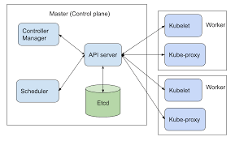

# Kubernetes components

*  etcd:is used as Kubernetes’ backing store for all cluster data

REF: [How to Deploy Nebula Graph on Kubernetes](https://dzone.com/articles/how-to-deploy-nebula-graph-on-kubernetes-a-step-by)